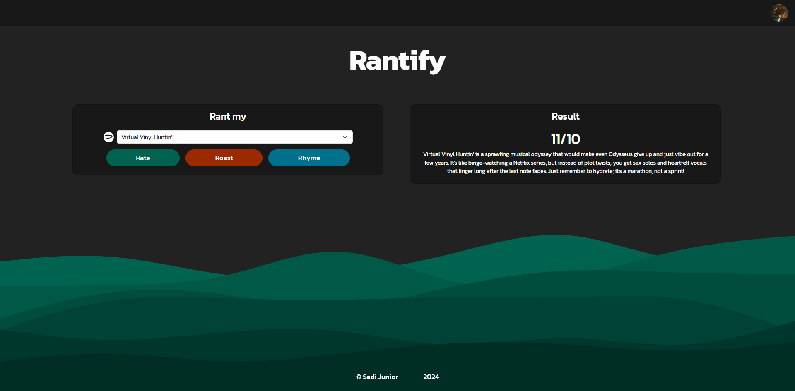

<div align="center">
  <h1 align="center">Rantify</h1>
  <h3>The Internet's busiest AI playlist reviewer.</h3>
</div>

<div align="center">
  <a href="https://rantify-d3dae4547d9a.herokuapp.com/">Rantify</a>
</div>

<br/>

Rantify is a web application that integrates Spotify with LLMs for generating reviews and rhymes on a given Spotify playlist.


## Demo




## Tech Stack

- [Flask](https://flask.palletsprojects.com/) – Framework
- [Python](https://www.python.org/) – Language
- [Bootstrap](https://getbootstrap.com/) – CSS
- [jQuery](https://jquery.com/) - JavaScript
- [Spotipy](https://spotipy.readthedocs.io/) – Spotify API Integration
- [LangChain OpenAI](https://python.langchain.com/v0.2/docs/integrations/platforms/openai/) – OpenAI API Integration
- [LangChain](https://python.langchain.com/v0.2/docs/introduction/) – LLM prompt and output parsing
- [Heroku](https://www.heroku.com/) – Hosting


## Getting Started

### Prerequisites

Here's what you need to be able to run Rantify:

- [Python](https://www.python.org/downloads/) (version >= 3.10)

API Keys for Spotify and OpenAI:
- Spotify - Follow the [Spotify Docs](https://developer.spotify.com/documentation/web-api/concepts/apps)
  - Client ID
  - Client Secret
  - Redirect URI
- OpenAI - Follow the [OpenAI Docs](https://platform.openai.com/docs/quickstart)
   - API Key

### 1. Clone the repository
``` shell
git clone https://github.com/SadiJunior/rantify.git
cd rantify
```

### 2. Create and activate Python virtual environment
``` shell
python -m venv .venv

.venv/bin/activate # Linux/macOS
.venv\Scripts\activate # Windows
```

### 3. Install dependencies
``` shell
pip install --upgrade pip
pip install -r requirements.txt
```

### 4. Create environment (`.env`) file
``` shell
cp .env.example .env # Linux/macOS
copy .env.example .env # Windows

code .env
```

### 5. Update the environment variables in `.env`
``` shell
# Flask app information
FLASK_CONFIG=development

# Session information
SECRET_KEY=<your-secret-key>

# Spotify information
SPOTIFY_CLIENT_ID=<your-spotify-client-id>
SPOTIFY_CLIENT_SECRET=<your-spotify-client-secret>
SPOTIFY_REDIRECT_URI=<your-spotify-redirect-uri>

# OpenAI information
OPENAI_API_KEY=<your-openai-api-key>
OPENAI_LLM_MODEL=gpt-4o-mini
```

### 6. Run the Flask dev server
``` shell
flask run
```

### 7. Open the app in your browser

Visit http://localhost:5000 in your browser.


## Known Issues

- **Error when Logging in:** Currently, the app is in development mode and needs to be accepted by Spotify for public release.
- **Dangerous site warning:** Sometimes Google Chrome may display a "Dangerous site" warning when trying to Log in with Spotify OAuth. You may proceed by clicking on "Details" and then "Visit this unsafe site."


## Future Expansion

### Features

- **Social Media integration:** Make the output shareable for social media. Generate Instagram Stories and Twitter posts for example.
- **More User Options:** Add options for generating rants on a user's top 10 most listened songs for a given time period or favorite artists.
- **Streaming Services Integration:** Add support for other music streaming services like Apple Music or Last.fm.


## Contributing

Rantify is a small open-source project, but I'd welcome contributions from the community.

If you'd like to contribute, please fork the repository and make changes as you'd like. Pull requests are warmly welcome.


## License

[MIT License](LICENSE.md) - Copyright (c) 2024 Sadi Junior
